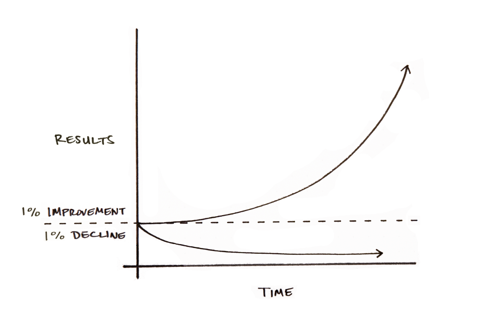
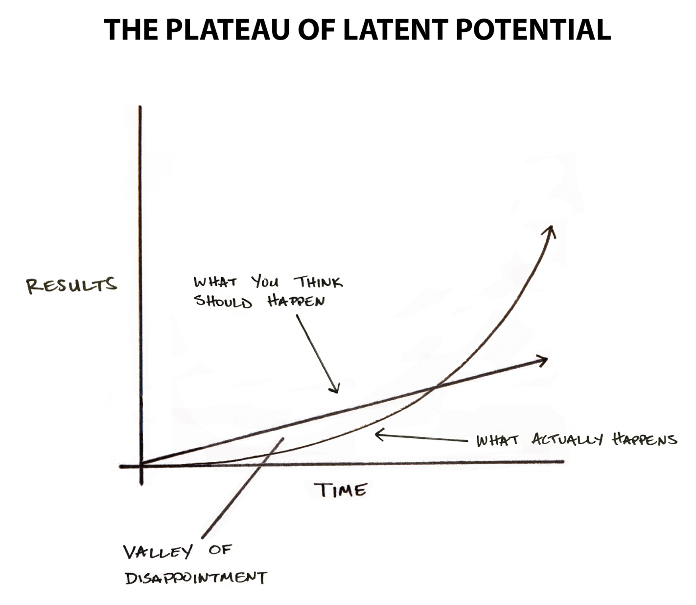
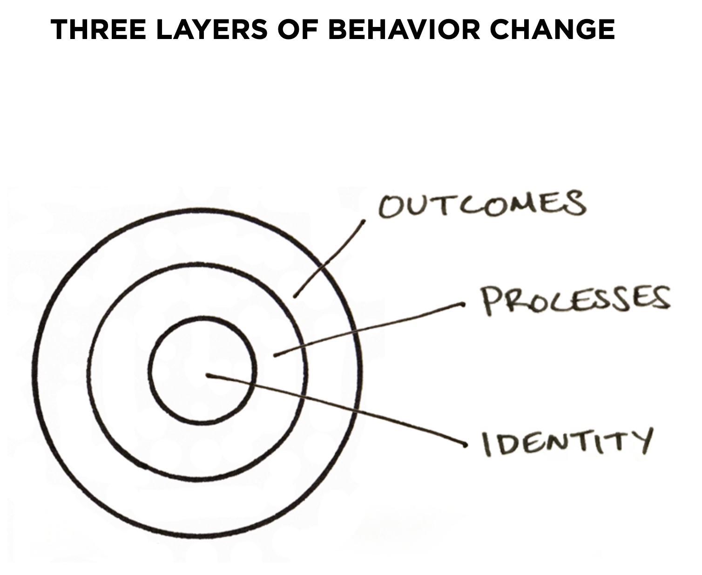

# Atomic Habits

## Compounding interest of self improvement

Small habits make a big difference. Habits are compounding interest of self improvement. For example, improving 1% every day for year yields 37x improvement.

Results don't come quickly, so we dismiss small changes. Making 1% better or worse choice in the moment seems insignificant, but over a span of a lifetime these choices determine difference between who you _are_ and who you _could be_. Success is product of daily habits, not once in a lifetime transformations.

Where you are right now doesn't matter as much as your current trajectory/ You get what you repeat.

> If you do not change direction, you may end up where you are heading.

## Breaking plateau of latent potential 

Most powerful outcomes are delayed. That's why it is hard to maintain new habits. Complaining about not achieving success, despite working hard, it's like complaining about not melting icecube when you heated it from -20 to -5. Work is not wasted, it's stored. When you finally break through, people will call overnight success. Mastery requires patience. 

> Success is where preparation and opportunity meet.

## Focus on system, not setting goals

If you are having problems with changing habits, the problem is the system.

3 levels of change: outcomes - what you want, processes - what you do identity - what you believe - the most effective for adopting new habits.

Each action is vote for that identity. First decide who you want to be, next prove it by making steps towards it. You become your habits. Score takes care of itself. Winners and losers have the same goals.
